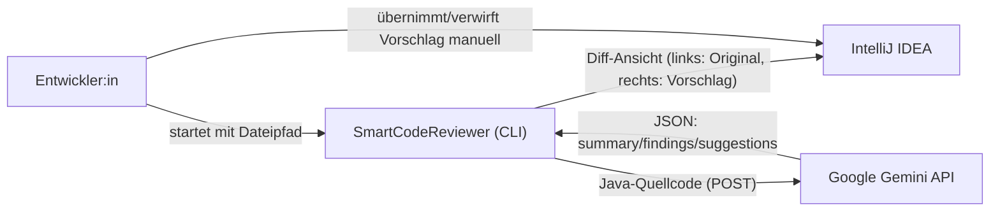
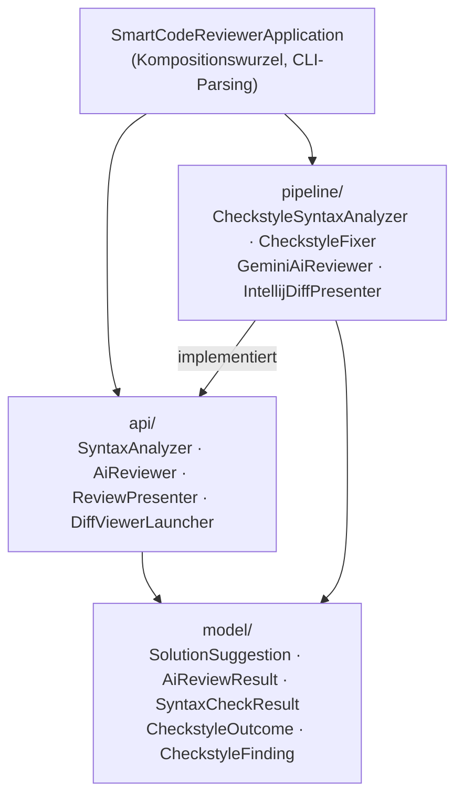
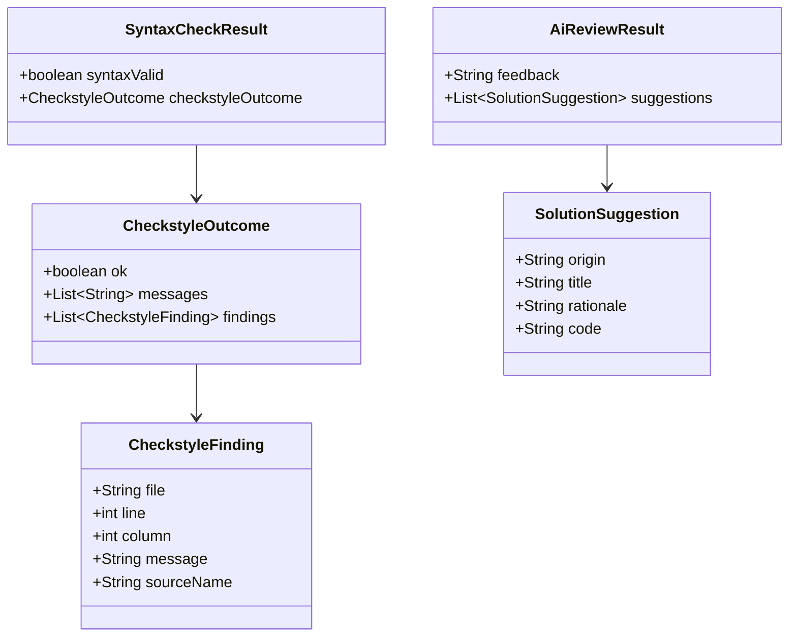
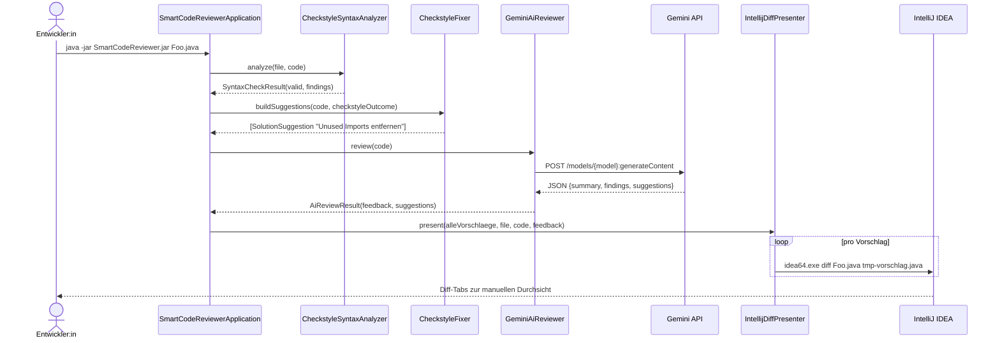
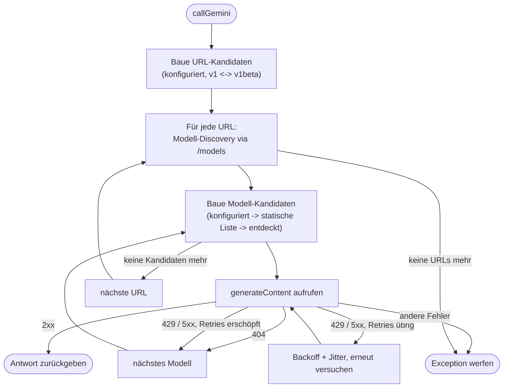
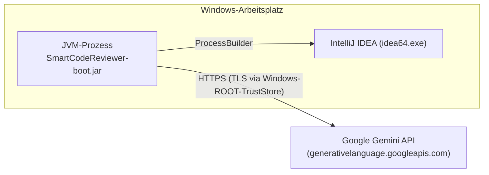

# SmartCodeReviewer — Architekturdokumentation (arc42)

> Diese Dokumentation folgt der [arc42](https://arc42.de)-Vorlage, gekürzt auf die für dieses Projekt relevanten Kapitel. Als Lernprojekt (AppAkademie) ist der Anspruch bewusst pragmatisch, nicht enterprise-vollständig.

## 1. Einführung und Ziele

### 1.1 Aufgabenstellung

SmartCodeReviewer ist ein CLI-Werkzeug, das eine einzelne Java-Datei automatisiert begutachtet, bevor ein Mensch sie liest: Es prüft die Syntax, lässt eine KI (Google Gemini) nach Logik-, Security- und Stilproblemen suchen, erzeugt daraus konkrete Verbesserungsvorschläge und präsentiert sie als Diff direkt in IntelliJ IDEA — ohne die Originaldatei automatisch zu verändern.

Typischer Aufruf:

```powershell
java -jar target/SmartCodeReviewer-0.0.1-SNAPSHOT-boot.jar MeineKlasse.java
```

### 1.2 Qualitätsziele

| Rang | Qualitätsziel | Motivation |
|---|---|---|
| 1 | **Kein Datenverlust** | Die Originaldatei wird nie automatisch überschrieben; jede Änderung geht über den Diff-Viewer, der Nutzer entscheidet. |
| 2 | **Kosteneffizienz** | Syntaktisch ungültiger Code wird gar nicht erst an die (kostenpflichtige) Gemini-API geschickt. |
| 3 | **Robustheit gegenüber der externen KI-API** | Modell-/Endpunkt-Fallback und Retry mit Backoff, damit einzelne Ausfälle/Deprecations der Gemini-API nicht die ganze Pipeline blockieren. |
| 4 | **Nachvollziehbarkeit** | Jeder Vorschlag trägt Herkunft (`Checkstyle` oder `KI`), Titel und Begründung; das KI-Feedback wird zusätzlich als Volltext geloggt. |
| 5 | **Testbarkeit der Kernlogik** | Pipeline-Schritte sind über Interfaces entkoppelt und einzeln unit-testbar, unabhängig von IntelliJ/Netzwerk. |

### 1.3 Stakeholder

| Rolle | Erwartung |
|---|---|
| Entwickler:in (Nutzer:in des Tools) | Schnelles, lokal integriertes Review einzelner Dateien direkt aus IntelliJ heraus |
| Projekt-Autor (AppAkademie-Lernkontext) | Saubere, nachvollziehbare Architektur als Übungsgegenstand |

## 2. Randbedingungen

### 2.1 Technische Randbedingungen

| Randbedingung | Ausprägung |
|---|---|
| Sprache/Runtime | Java 26 |
| Build | Maven (`mvnw.cmd`), `spring-boot-maven-plugin` erzeugt eine Boot-Jar (`-boot.jar`) |
| Framework | Spring Boot 4.0.5 — **nur als Dependency-Verwaltung**, kein Spring-Context zur Laufzeit (siehe [ADR-1](#9-architekturentscheidungen)) |
| Logging | Log4j2 (`spring-boot-starter-logging` ist bewusst ausgeschlossen) |
| Externe Dienste | Google Gemini API (`generativelanguage.googleapis.com`), optional lokale IntelliJ-Installation |
| Betriebssystem | Primär Windows (PowerShell-Wrapper, `Windows-ROOT`-TrustStore für TLS, `idea64.exe`-Discovery) |
| Statische Analyse | Checkstyle 13.4.0 (eingebettet), JetBrains Qodana (CI/CD, `qodana.yaml`) |

### 2.2 Organisatorische Randbedingungen

- Einzelentwickler-Lernprojekt, kein Team-Review-Prozess.
- Kein Git-Repository im Arbeitsverzeichnis vorhanden (Stand dieser Dokumentation) — Versionierung/Historie ist dadurch nicht über `git log` nachvollziehbar.
- `application.properties` kann einen echten API-Key enthalten und darf nicht committet werden.

## 3. Kontextabgrenzung

### 3.1 Fachlicher Kontext



### 3.2 Technischer Kontext

| Nachbarsystem | Richtung | Protokoll/Format | Zweck |
|---|---|---|---|
| Dateisystem | ⇄ | lokale Pfade | Eingabedatei lesen, temporäre Vorschlagsdatei für den Diff schreiben |
| Google Gemini API | → / ← | HTTPS + JSON (`java.net.http.HttpClient`) | KI-Review des Codes |
| IntelliJ IDEA (`idea64.exe` o. Ä.) | → | Prozessstart (`ProcessBuilder`, CLI-Argument `diff <links> <rechts>`) | Diff-Viewer öffnen |
| `application.properties` / Umgebungsvariablen | → | Properties / Env | Konfiguration (API-Key, Modell, URL, Launcher-Pfad) |

## 4. Lösungsstrategie

- **Reines CLI statt Spring-Anwendung**: `@SpringBootApplication` ist nur deklariert, um Spring-Boot-Tooling (Dependency-Management, `spring-boot-maven-plugin`) zu nutzen; `main()` startet keinen Application-Context, sondern verdrahtet die Pipeline-Objekte manuell. Das hält Startzeit und Komplexität niedrig, wo Dependency Injection keinen Mehrwert bringt (siehe [ADR-1](#9-architekturentscheidungen)).
- **Vier-Schritte-Pipeline statt monolithischer Methode**: Jeder Schritt (Syntax, Checkstyle-Auto-Fix, KI-Review, Präsentation) ist eine eigene Klasse hinter einem Interface (`api/`). Das macht jeden Schritt einzeln testbar und austauschbar, ohne die anderen zu berühren.
- **"Fail cheap, fail fast"**: Der Syntax-Check läuft immer zuerst und bricht bei ungültigem Code ab — die kostenpflichtige KI-Anfrage wird nur bei validem Code gestellt.
- **Zwei unabhängige Vorschlagsquellen**: Deterministische Checkstyle-Fixes (`CheckstyleFixer`) und nicht-deterministische KI-Vorschläge (`GeminiAiReviewer`) werden getrennt erzeugt und erst in der Präsentationsschicht zusammengeführt — ein Ausfall der KI verhindert nicht die (einfacheren) Checkstyle-Fixes.
- **Mehrstufige Fallback-Strategie gegen API-Instabilität**: API-Basis-URL (`v1`/`v1beta`) × Modell-Kandidaten (konfiguriert → statische Liste → dynamisch via `/models` entdeckt) × Retry mit exponentiellem Backoff und Jitter bei transienten HTTP-Fehlern (429, 5xx).
- **Sicherheit vor Funktionsumfang**: Eine automatische Stern-Import-Auflösung wurde nach einer KI-gestützten Selbstprüfung ersatzlos entfernt, weil sie `Class.forName` mit aus Fremdcode extrahierten Namen aufrief (siehe [ADR-2](#9-architekturentscheidungen)) — lieber weniger Funktionalität als ein Sicherheitsrisiko.

## 5. Bausteinsicht

### 5.1 Ebene 1 — Pakete



| Paket | Verantwortung |
|---|---|
| *(root)* `SmartCodeReviewerApplication` | CLI-Argumente parsen, Implementierungen hinter den Interfaces verdrahten, die vier Pipeline-Schritte in Reihenfolge aufrufen. Enthält bewusst **keine** Fachlogik. |
| `api/` | Schnittstellen, gegen die die Pipeline-Schritte programmiert sind (`SyntaxAnalyzer`, `AiReviewer`, `ReviewPresenter`, `DiffViewerLauncher`) — ermöglicht Austauschbarkeit und Tests mit Test-Doubles. |
| `model/` | Unveränderliche Records, die zwischen den Schritten übergeben werden. |
| `pipeline/` | Konkrete Implementierungen der Interfaces, siehe 5.2. |

### 5.2 Ebene 2 — Klassen in `pipeline/`

| Klasse | Implementiert | Rolle |
|---|---|---|
| `CheckstyleSyntaxAnalyzer` | `SyntaxAnalyzer` | Schritt 1: Checkstyle-Lauf (nur `UnusedImports`, `AvoidStarImport`) mit javac-Parse-Fallback bei Checkstyle-Fehlern. Sammelt Findings über die innere Klasse `CollectingAuditListener`. |
| `CheckstyleFixer` | *(kein Interface — direkt von der Kompositionswurzel genutzt)* | Erzeugt deterministische Auto-Fix-Vorschläge aus Checkstyle-Findings; aktuell nur Entfernen ungenutzter Imports (siehe [ADR-2](#9-architekturentscheidungen) zur entfernten Stern-Import-Auflösung). |
| `GeminiAiReviewer` | `AiReviewer` | Schritt 3: POST an die Gemini-API, JSON-Antwort-Parsing, URL-/Modell-/Retry-Fallback-Kette. Interne `GeminiHttpException` transportiert den HTTP-Status für die Retry-Entscheidung. |
| `IntellijDiffPresenter` | `ReviewPresenter` | Schritt 4: öffnet je Vorschlag einen IntelliJ-Diff-Tab, reichert den Vorschlagscode mit Inline-Vorschau-Kommentaren an (LCS-Diff über `DiffLine`/`DiffType`). Der tatsächliche Prozessstart ist über `DiffViewerLauncher` injizierbar (Default: `tryOpenIntellijDiff`, sucht IntelliJ über Toolbox/`Program Files`/`LOCALAPPDATA`). |

### 5.3 Datenmodell (`model/`)



Alle Modell-Typen sind Java-Records — unveränderlich, keine Fachlogik, reine Datenträger zwischen den Pipeline-Schritten.

## 6. Laufzeitsicht

### 6.1 Regelfall: Review einer gültigen Datei mit Findings



### 6.2 Abbruch bei ungültiger Syntax

Meldet `CheckstyleSyntaxAnalyzer.analyze()` `syntaxValid = false`, loggt `SmartCodeReviewerApplication` einen Fehler und beendet sich **vor** Schritt 3 — kein API-Call, keine Kosten.

### 6.3 Gemini nicht erreichbar / kein API-Key

`GeminiAiReviewer.review()` fängt alle Fehler intern ab und liefert ein `AiReviewResult` mit erklärendem Feedback-Text und leerer Vorschlagsliste. Die Pipeline läuft weiter; `IntellijDiffPresenter` zeigt dann nur die (falls vorhandenen) Checkstyle-Fixes. Sind auch die leer, wird nur eine Warnung geloggt — die Datei bleibt unverändert.

### 6.4 Retry/Fallback-Kette innerhalb `callGemini`



## 7. Verteilungssicht

Ein einzelner Prozess, lokal auf der Entwickler-Maschine:



Es gibt keine Server-Komponente, keine Datenbank und keine dauerhafte Prozess-Instanz — jeder Aufruf ist ein kurzlebiger CLI-Prozess.

## 8. Querschnittliche Konzepte

### 8.1 Fehlerbehandlung

Durchgängiges Muster: Fehler in den äußeren Pipeline-Schritten (KI-Aufruf, Diff-Viewer-Start) werden **nicht** propagiert, sondern in ein "leeres/negatives" Ergebnis übersetzt (leere Vorschlagsliste, `false`-Rückgabe) und geloggt. Nur ein Syntaxfehler in Schritt 1 stoppt die Pipeline aktiv. Das verhindert, dass ein einzelner instabiler externer Dienst (Gemini, IntelliJ-Prozessstart) das ganze Tool abstürzen lässt.

### 8.2 Logging

Ausschließlich Log4j2 (`LOGGER`), konfiguriert in `src/main/resources/log4j2.xml`. Keine `System.out`-Aufrufe. Jeder Pipeline-Schritt loggt seinen Start (`[Step n] ...`) sowie Ergebnisse/Fehler.

### 8.3 Konfiguration

Einheitliches Präzedenz-Muster über alle konfigurierbaren Werte: **Umgebungsvariable → `application.properties` → Hartcodierter Default**. Siehe Tabelle in Kapitel 2 der README/CLAUDE.md bzw. `SmartCodeReviewerApplication.usage()`.

### 8.4 Sicherheit

- Keine Ausführung von im Zielcode enthaltenem Code — bewusste Design-Entscheidung, siehe [ADR-2](#9-architekturentscheidungen).
- API-Keys werden nie geloggt (Endpunkt-Logs maskieren den Key als `***`).
- `application.properties` mit echtem Key ist per Konvention nicht zu committen (siehe `.gitignore`-Hinweis in `CLAUDE.md`).

### 8.5 Testbarkeit

Jede `pipeline/*`-Klasse implementiert ein `api/*`-Interface und hat eine korrespondierende Testklasse in `src/test/java/.../tests/`. `IntellijDiffPresenter` ist zusätzlich über den injizierbaren `DiffViewerLauncher`-Konstruktor ohne echten IntelliJ-Prozess testbar.

## 9. Architekturentscheidungen

**ADR-1: Spring Boot nur als Dependency-Management, kein laufender Application-Context**
*Kontext:* Das Tool ist eine kurzlebige CLI-Ausführung ohne Web-Server, Datenbank oder mehrere kollaborierende Beans.
*Entscheidung:* `@SpringBootApplication` bleibt deklariert (für `spring-boot-maven-plugin`, Dependency-BOM), `main()` ruft aber keinen `SpringApplication.run()` auf, sondern verdrahtet die Pipeline-Objekte manuell (`new CheckstyleSyntaxAnalyzer()` etc.).
*Konsequenz:* Schnellerer Start, einfacherer Code; kein DI-Container, keine Spring-Annotations-Vorteile (Profiles, `@Value`, Testcontext) — Konfiguration läuft stattdessen über eine simple `Properties`-Instanz.

**ADR-2: Entfernung der automatischen Stern-Import-Auflösung in `CheckstyleFixer`**
*Kontext:* Ein KI-Review der eigenen Codebasis (Dogfooding) deckte auf, dass `replaceStarImportWithExplicitImports` Typ-Namen aus dem *zu analysierenden Fremdcode* per `Class.forName` gegen den Classpath von SmartCodeReviewer selbst auflöste.
*Problem:* Sicherheitsrisiko (Laden/Initialisieren beliebiger Klassen anhand von aus nicht-vertrauenswürdigem Quellcode extrahierten Namen) plus fachlicher Fehler (falscher Classpath, unzuverlässige Großbuchstaben-Heuristik zur Typerkennung).
*Entscheidung:* Funktionalität ersatzlos entfernt statt gepatcht — ein korrekter Fix bräuchte einen echten Java-Parser/Symbol-Resolver mit dem Classpath des Zielprojekts, was den Rahmen des einfachen Checkstyle-Fixers sprengt.
*Konsequenz:* `AvoidStarImportCheck`-Findings werden weiterhin von Checkstyle gemeldet, aber nicht mehr automatisch gefixt; nur die KI kann hierfür (unverbindlich) einen Vorschlag liefern.

**ADR-3: Zwei unabhängige, additive Vorschlagsquellen statt einer gemeinsamen Pipeline**
*Kontext:* Sowohl Checkstyle-Findings als auch KI-Antworten können Verbesserungsvorschläge liefern.
*Entscheidung:* `CheckstyleFixer` (deterministisch, offline) und `GeminiAiReviewer` (nicht-deterministisch, online) laufen unabhängig; ihre `SolutionSuggestion`-Listen werden erst in der Kompositionswurzel zusammengeführt.
*Konsequenz:* Ausfall/Leerantwort der KI verhindert nicht die einfacheren, verlässlichen Checkstyle-Fixes; beide Quellen sind separat testbar.

## 10. Qualitätsanforderungen

Szenarien zu den Zielen aus Kapitel 1.2:

| Szenario | Erwartetes Verhalten | Abgedeckt durch |
|---|---|---|
| Datei enthält Syntaxfehler | Pipeline bricht vor dem Gemini-Aufruf ab | `CheckstyleSyntaxAnalyzer` + Abbruch in `SmartCodeReviewerApplication` |
| Gemini antwortet mit HTTP 503 | Bis zu 3 Retries mit steigendem Backoff, danach nächster Modell-/URL-Kandidat | `GeminiAiReviewer.callGemini` |
| Kein API-Key konfiguriert | Klarer Hinweistext im Feedback statt Absturz | `GeminiAiReviewer.review` |
| KI liefert kein valides JSON | Rohtext wird als Feedback übernommen, keine Suggestions | `GeminiAiReviewer.parseAiReview` |
| Kein IntelliJ installiert/gefunden | Fehler wird geloggt, Prozess terminiert kontrolliert (kein Crash) | `IntellijDiffPresenter.tryOpenIntellijDiff` |
| Checkstyle-Fix soll Typen aus Fremdcode nicht ausführen | Keine `Class.forName`-Aufrufe mit fremdcode-abgeleiteten Namen mehr | `CheckstyleFixer` (siehe ADR-2), Regressionstest in `CheckstyleFixerTest` |

## 11. Risiken und technische Schulden

| Risiko / Schuld | Beschreibung | Mögliche Gegenmaßnahme |
|---|---|---|
| Windows-Kopplung | IntelliJ-Discovery-Pfade, TrustStore-Handling (`Windows-ROOT`) und Wrapper-Skripte sind Windows-spezifisch | Plattform-Abstraktion, falls macOS/Linux relevant werden |
| Kein Git-Repository im Projektverzeichnis | Keine Versionshistorie, keine Nachvollziehbarkeit von Änderungen über `git log` | Repository initialisieren, Commits nachziehen |
| Reale API-Keys in `application.properties` | Versehentliches Commit möglich, wenn `.gitignore` nicht greift oder Datei manuell hinzugefügt wird | Secret-Scanning, Key konsequent nur über Umgebungsvariable setzen |
| Kein AST-basiertes Code-Verständnis | Sowohl `CheckstyleFixer` (Zeilen-basiert) als auch der Diff-Mechanismus (`IntellijDiffPresenter`) arbeiten rein textuell/LCS-basiert, nicht semantisch | Bei Bedarf echten Java-Parser (z. B. JavaParser) einführen |
| Gemini-Antwortformat ist Prompt-Vertrag, kein Schema | Die KI könnte trotz Anweisung invalides JSON oder unerwartete Felder liefern | Bereits abgefedert durch Fallback auf Rohtext; ggf. striktere Schema-Validierung ergänzen |
| Manuelle Objekt-Verdrahtung ohne DI-Container | Bei wachsender Zahl von Implementierungen/Konfigurationsoptionen könnte die Kompositionswurzel unübersichtlich werden | Bei Bedarf auf ein leichtgewichtiges DI erneut zurückgreifen (Spring ist bereits als Dependency vorhanden) |

## 12. Glossar

| Begriff | Bedeutung |
|---|---|
| **Kompositionswurzel** | Der eine Ort im Code (`SmartCodeReviewerApplication.main`), an dem konkrete Implementierungen erzeugt und hinter ihren Interfaces verdrahtet werden. |
| **Checkstyle-Finding** | Eine einzelne von Checkstyle gemeldete Regelverletzung (Datei, Zeile, Spalte, Meldungstext, Check-Quelle). |
| **SolutionSuggestion** | Ein konkreter Verbesserungsvorschlag (Titel, Begründung, vollständiger neuer Code) — egal ob von Checkstyle oder der KI erzeugt. |
| **LCS-Diff** | *Longest Common Subsequence* — Algorithmus, mit dem `IntellijDiffPresenter` zeilenweise Unterschiede zwischen Original und Vorschlag berechnet, um Inline-Kommentare zu platzieren. |
| **Transienter Fehler** | Ein HTTP-Fehler (429, 5xx), bei dem ein erneuter Versuch sinnvoll ist, im Unterschied zu permanenten Fehlern (401, 403, 404). |
